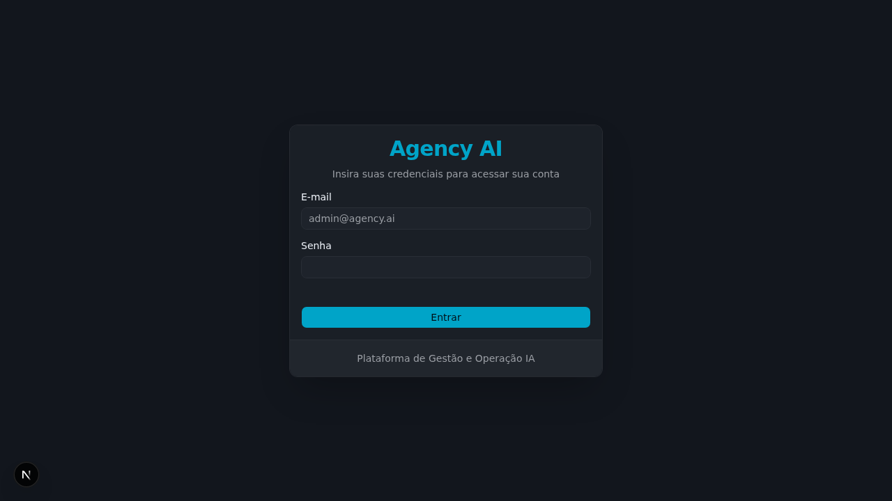
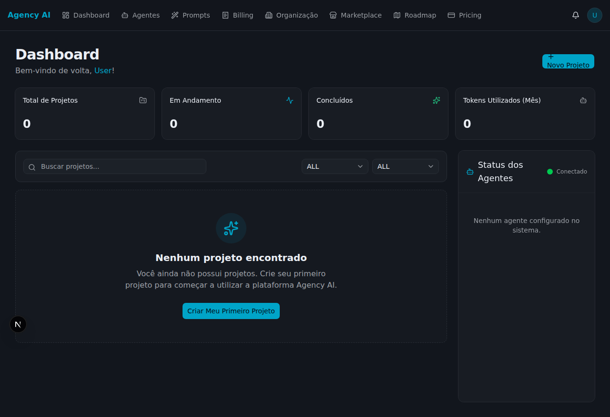
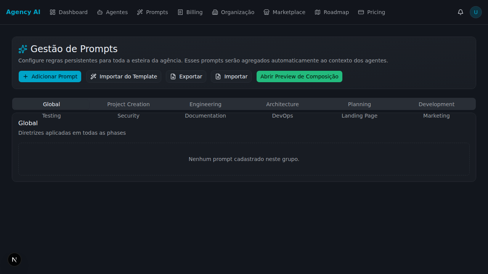
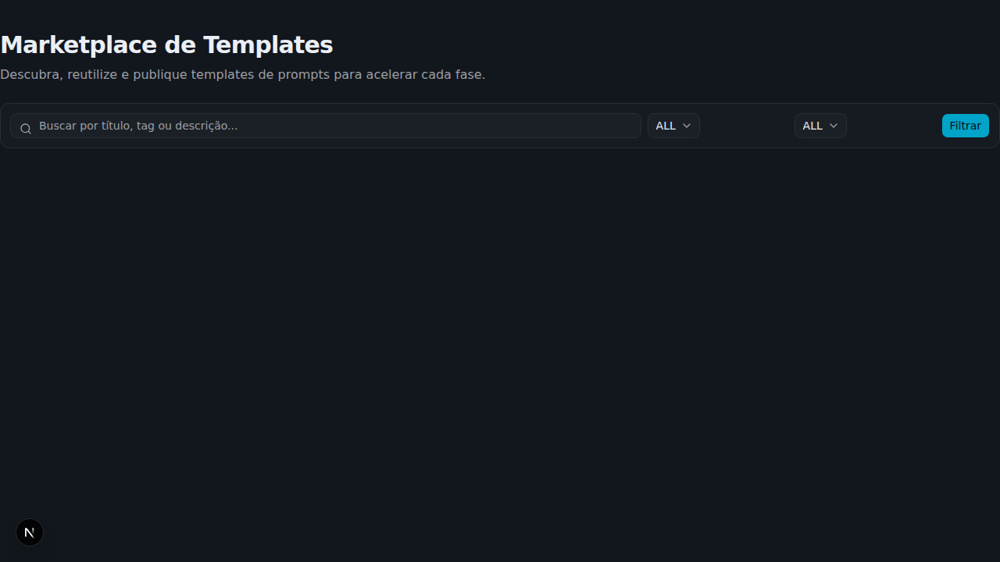
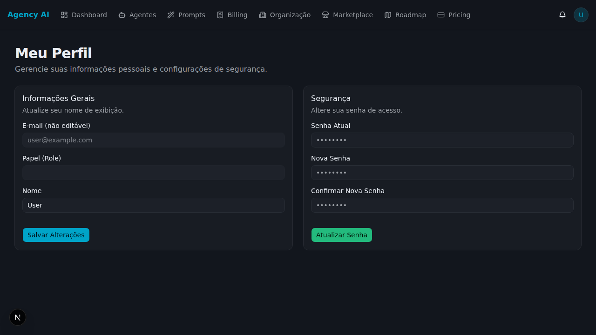
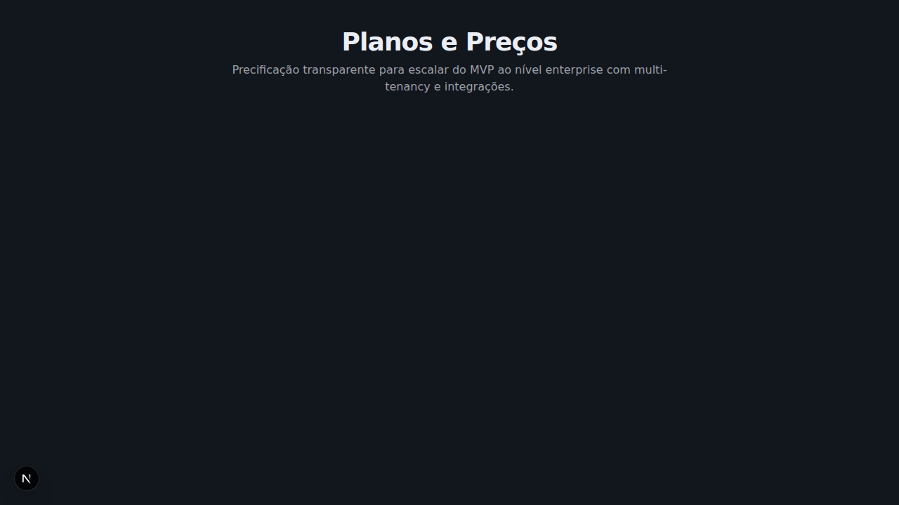

# Guia de Uso da Plataforma

Bem-vindo(a) ao Guia de Uso! Esta documentação foi criada para ajudar você a navegar e aproveitar ao máximo todas as funcionalidades da nossa plataforma. A seguir, apresentamos um passo a passo para cada uma das seções principais.

## Índice
1. [Autenticação (Login)](#1-autenticação-login)
2. [Dashboard](#2-dashboard)
3. [Projetos (Projects)](#3-projetos-projects)
4. [Prompts](#4-prompts)
5. [Marketplace](#5-marketplace)
6. [Perfil (Profile)](#6-perfil-profile)
7. [Preços (Pricing)](#7-preços-pricing)

---

## 1. Autenticação (Login)

Para acessar a plataforma, você precisa se autenticar.

**Passo a passo:**
1. Acesse a página inicial ou a rota de `/login`.
2. Insira suas credenciais (E-mail e Senha) nos campos indicados.
3. Clique no botão de acesso. Caso não tenha uma conta, você pode ser redirecionado para a página de registro (se habilitado).

---

## 2. Dashboard

Logo após o login, você será direcionado para o **Dashboard**. É a tela principal de controle onde você terá um resumo das suas atividades e atalhos rápidos.

**Principais funcionalidades:**
- Visão geral das estatísticas de uso.
- Acesso rápido aos projetos recentes e aos prompts salvos.
- Navegação lateral (Sidebar) para as demais áreas do sistema.

---

## 3. Projetos (Projects)

Na aba de **Projetos**, você gerencia todos os fluxos de trabalho e entregáveis.

**Passo a passo para usar:**
1. Clique em "Projects" no menu de navegação.
2. Para **criar um novo projeto**, clique no botão "Novo Projeto" (ou equivalente) e preencha as informações básicas (nome, descrição, etc.).
3. Para **visualizar detalhes**, clique no nome de um projeto existente. Você poderá gerenciar o andamento, arrastar itens em formato Kanban (se disponível) e editar o progresso.

---

## 4. Prompts

A biblioteca de **Prompts** permite que você crie, salve e utilize instruções pré-formatadas para guiar a inteligência artificial.

**Passo a passo para usar:**
1. Acesse "Prompts" pelo menu lateral.
2. Visualize a lista de prompts prontos ou crie um novo.
3. Ao criar, defina um nome, o contexto e as variáveis necessárias.
4. Salve para poder reutilizá-lo em seus projetos futuros.

---

## 5. Marketplace

O **Marketplace** é a área onde você encontra ferramentas e serviços de IA prontos para integração.

**Passo a passo para usar:**
1. Navegue até a seção "Marketplace".
2. Explore a lista de integrações e ferramentas disponíveis.
3. Clique na ferramenta desejada para visualizar os detalhes, como funciona e as opções de assinatura ou instalação na sua conta.

---

## 6. Perfil (Profile)

A seção de **Perfil** é onde você gerencia as suas informações pessoais e de conta.

**Passo a passo para usar:**
1. Clique no seu avatar ou no menu "Profile".
2. Você pode atualizar seu nome, e-mail e foto de perfil.
3. É possível também alterar preferências de tema ou notificações, dependendo das configurações habilitadas.

---

## 7. Preços (Pricing)

Caso precise atualizar seu plano ou visualizar o que sua assinatura atual permite, acesse a página de **Pricing**.

**Passo a passo para usar:**
1. Clique em "Pricing" no menu.
2. Compare os planos disponíveis (Free, Pro, Enterprise, etc.).
3. Verifique os limites de uso e clique no botão de assinatura para alterar seu plano caso necessário.

---

> **Dica:** A plataforma foi desenhada no modo escuro (dark mode) para oferecer melhor ergonomia visual. Caso encontre problemas, verifique se a sua conexão de internet está estável ou se o sistema não está passando por manutenções através da página de Status.
